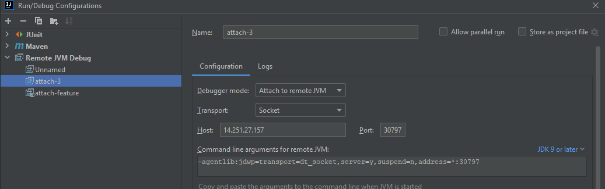
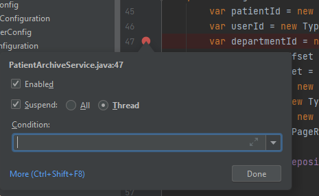

* Make sure .jar runs with remote debug enabled:
    `-Xdebug -Xrunjdwp:server=y,transport=dt_socket,address=*:7775,suspend=n`
* Connect:
    * Lens -> Network -> Services -> Ports 7775:30797
    * Idea -> Edit configurations -> Remote JVM Debug
        * Get public port form previous step
        * Get IP address from kubeconfig (or localhost if you use port forwarding)
        
* Idea -> Add thread breakpoint
    
