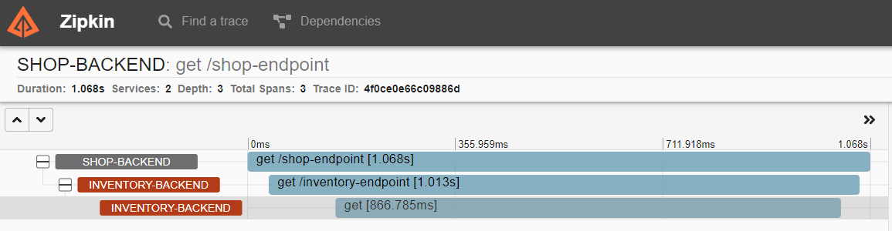

### Zipkin/Sleuth Getting started
* Info
    * Sleuth - adds http headers (traceID, spanID)
    * Zipkin client - gathers timing data for requests
* Getting ready. Zipkin server:
    * Run zipkin on a server (look at `devops` repo)
    * Replace `localhost` in `application.yml` with server url
* Getting ready. Request bin:
    * Create request bin - https://requestbin.com/
    * Insert new endpoint URL in InventoryController
* Run project:
    * Import `shop` project, execute `gradlew bootRun`
    * Import `inventory` project, execute `gradlew bootRun`
* Test everything:
    * Open in a browser - http://localhost:8081/shop-endpoint
        * TraceID and SpanID will appear in logs: 
            * `[shop-backend,4f0ce0e66c09886d,4f0ce0e66c09886d,true] Shop demo`
            * `[inventory-backend,4f0ce0e66c09886d,ec2dfcf200cfa5a9,true] Inventory demo`
        * In https://requestbin.com/ will appear request with headers:
            ```
            x-b3-traceid = 4f0ce0e66c09886d
            x-b3-spanid = 4905ba1039c440d3
            x-b3-parentspanid = ec2dfcf200cfa5a9
            x-b3-sampled = 1
            ```
    * Open zipkin web ui, search by traceId, should show three requests:
        * Shop-backend -> Inventory-backend -> Request-bin
        * 
    * Open in a browser - http://localhost:8081/skip-endpoint
        * Nothing should appear in zipkin, because of `additionalSkipPattern`

### Zipkin UI
* Useful feature:
    * Filter to find slow queries `minDuration=1s`
    * Filter to find errors `tagQuery=error`
    * Search by trace ID
    * Dependencies (overview of services and http traffic between them)
